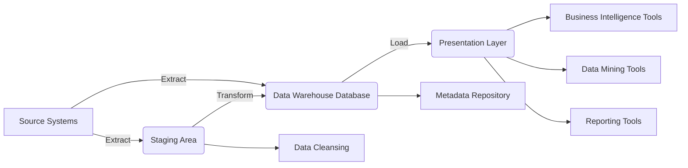
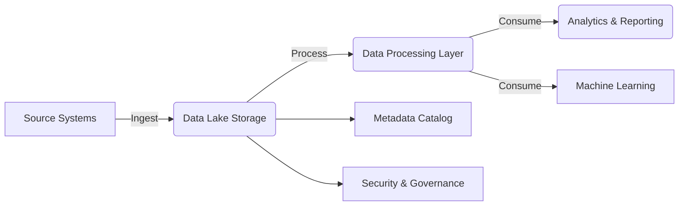
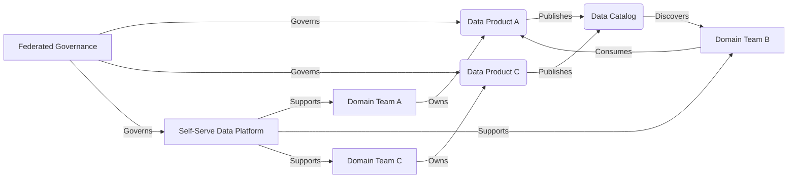

# Data Management in AI Projects. Strategies for handling data in an organization

**Duration:** 90 minutes

**Authors:** Claudio Canales

-----

## Table of Contents

  - [Learning Objectives](#learning-objectives)
  - [I. Introduction](#i-introduction-5-minutes)
      - [A. Importance of Data Management in AI Projects](#a-importance-of-data-management-in-ai-projects)
      - [B. Overview of Course Structure](https://www.google.com/url?sa=E&source=gmail&q=#b-overview-of-course-structure)
  - [II. Data Management in AI Projects: Overview](#ii-data-management-in-ai-projects-overview-10-minutes)
      - [A. Definition of Data Management in AI Context](#a-definition-of-data-management-in-ai-context)
      - [B. Key Challenges in Managing Data for AI Projects](#b-key-challenges-in-managing-data-for-ai-projects)
      - [C. Role of Data Management in AI Project Success](#c-role-of-data-management-in-ai-project-success)
      - [D. Impact of Poor Data Management on AI Outcomes](#d-impact-of-poor-data-management-on-ai-outcomes)
  - [III. Strategies for Handling Data in an Organization](#iii-strategies-for-handling-data-in-an-organization-25-minutes)
      - [A. Data Governance](#a-data-governance)
          - [1. Establishing Data Ownership and Stewardship](#1-establishing-data-ownership-and-stewardship)
          - [2. Creating Data Policies and Standards](#2-creating-data-policies-and-standards)
          - [3. Implementing Data Governance Frameworks](#3-implementing-data-governance-frameworks)
          - [4. Ensuring Regulatory Compliance (e.g., GDPR, CCPA)](#4-ensuring-regulatory-compliance-eg-gdpr-ccpa)
      - [B. Data Quality Management](#b-data-quality-management)
          - [1. Data Quality Dimensions](#1-data-quality-dimensions)
          - [2. Data Quality Checks and Validation Processes](#2-data-quality-checks-and-validation-processes)
          - [3. Data Cleansing and Enrichment Techniques](#3-data-cleansing-and-enrichment-techniques)
          - [4. Continuous Monitoring and Improvement](#4-continuous-monitoring-and-improvement)
      - [C. Data Security and Privacy](#c-data-security-and-privacy)
          - [1. Access Controls and Authentication Mechanisms](#1-access-controls-and-authentication-mechanisms)
          - [2. Data Encryption and Masking Techniques](#2-data-encryption-and-masking-techniques)
          - [3. Data Anonymization and Pseudonymization](#3-data-anonymization-and-pseudonymization)
          - [4. Regular Security Audits and Vulnerability Assessments](#4-regular-security-audits-and-vulnerability-assessments)
      - [D. Scalability and Performance Considerations](#d-scalability-and-performance-considerations)
          - [1. Designing Scalable Data Architectures](#1-designing-scalable-data-architectures)
          - [2. Optimizing Data Storage and Retrieval Processes](#2-optimizing-data-storage-and-retrieval-processes)
          - [3. Implementing Distributed Computing](#3-implementing-distributed-computing)
          - [4. Monitoring and Tuning System Performance](#4-monitoring-and-tuning-system-performance)
  - [IV. Data Lifecycle](#iv-data-lifecycle-20-minutes)
      - [A. Data Collection](#a-data-collection)
      - [B. Data Processing](#b-data-processing)
      - [C. Data Storage](#c-data-storage)
      - [D. Data Analysis](#d-data-analysis)
      - [E. Data Archiving and Deletion](#e-data-archiving-and-deletion)
  - [V. Data Repositories](#v-data-repositories-25-minutes)
      - [A. Data Warehouse](#a-data-warehouse)
          - [1. Definition and Characteristics](#1-definition-and-characteristics)
          - [2. Architecture and Components](#2-architecture-and-components)
          - [3. ETL Processes and Data Integration](#3-etl-processes-and-data-integration)
          - [4. Use Cases and Benefits for AI Projects](#4-use-cases-and-benefits-for-ai-projects)
      - [B. Data Lake](#b-data-lake)
          - [1. Definition and Characteristics](#1-definition-and-characteristics-1)
          - [2. Differences from Data Warehouses](#2-differences-from-data-warehouses)
          - [3. Architecture and Technologies](#3-architecture-and-technologies)
          - [4. Challenges and Best Practices](#4-challenges-and-best-practices)
      - [C. Data Mesh](#c-data-mesh)
          - [1. Introduction to the Concept](#1-introduction-to-the-concept)
          - [2. Principles of Data Mesh](#2-principles-of-data-mesh)
          - [3. Implementing Data Mesh Architecture](#3-implementing-data-mesh-architecture)
          - [4. Advantages and Challenges for AI Projects](#4-advantages-and-challenges-for-ai-projects)
  - [VI. Conclusion and Best Practices](#vi-conclusion-and-best-practices-5-minutes)
      - [A. Recap of Key Points](#a-recap-of-key-points)
      - [B. Best Practices for Data Management in AI Projects](#b-best-practices-for-data-management-in-ai-projects)
      - [C. Future Trends in Data Management for AI](#c-future-trends-in-data-management-for-ai)

-----

### Learning Objectives

By the end of this session, learners will be able to:

- **Explain** the role and importance of data management in AI projects: Understand why data management is a strategic necessity in AI workflows.  
- **Identify** and **analyze** the key challenges in managing data for AI: Recognize and articulate the hurdles associated with data volume, variety, velocity, quality, labeling, security, and versioning.  
- **Describe** and **implement** strategies for data governance, data quality management, data security, and scalability: Establish frameworks, processes, and techniques to ensure data is well-governed, high-quality, secure, and scalable.  
- **Outline** the stages of the data lifecycle and the considerations at each stage: Understand the journey of data from collection to deletion and how to manage it effectively.  
- **Differentiate** between various data repositories (Data Warehouse, Data Lake, Data Mesh): Compare their architecture, use cases, benefits, and challenges to determine their suitability for specific scenarios.  
- **Apply** best practices for data management in AI projects: Implement actionable strategies and techniques to improve the efficiency and effectiveness of AI initiatives.  

-----

## I. Introduction (5 minutes)

Let's start our exploration into the critical world of **Data Management in AI Projects**. This foundational topic is crucial for the success of any AI initiative.

### A. Importance of Data Management in AI Projects

In the realm of Artificial Intelligence, data is the lifeblood, the foundation, and the fuel. The performance, accuracy, reliability, and even the ethical implications of AI models are linked to the quality and management of the data they are trained on.

**Think of it like building a house:**

  - **Data is the foundation.** Poor data will lead to an inaccurate AI model.
  - **Data management is the blueprint and construction process.** Good data management is essential for a successful AI project.

**Garbage in, garbage out** is a fundamental truth in AI. Poorly managed data leads to:

  - **Flawed models:** Models that produce inaccurate predictions or unreliable results.
  - **Biased outcomes:** Reinforcing and amplifying existing biases present in the data.
  - **Compromised insights:** Drawing incorrect conclusions and making poor decisions.
  - **Failed AI projects:** Wasting resources, time, and failing to achieve the desired objectives.

Effective data management is a strategic imperative. It's the difference between:

  - **An AI project that delivers value and drives innovation** and one that falters.
  - **A model that is trustworthy and reliable** and one that is unpredictable.

**Running Example: ShopSmart**

To illustrate these concepts, let's introduce our running example: **ShopSmart**, a mid-sized e-commerce company selling a variety of products online. ShopSmart wants to use AI to improve its business operations and customer experience. We'll revisit ShopSmart throughout this course to see how data management principles apply in a real-world context.

### B. Overview of Course Structure

To thoroughly cover this vital topic, today's course will be structured as follows:

| **Topic**                          | **Description**                                                                                                                  |
|------------------------------------|-------------------------------------------------------------------------------------------------------------------------------|
| **Data Management in AI Projects: Overview** | Define data management in the AI context, explore its unique challenges, and understand its critical role in project success.   |
| **Strategies for Handling Data in an Organization** | Learn core strategies for effective data management, including data governance, quality management, security, privacy, and scalability. |
| **Data Lifecycle**                 | Step through the entire data lifecycle, from collection to archival or deletion, highlighting key considerations at each stage. |
| **Data Repositories**              | Explore and compare Data Warehouses, Data Lakes, and Data Mesh, analyzing their strengths, weaknesses, and use cases for AI.    |
| **Conclusion and Best Practices**  | Synthesize key takeaways, outline actionable best practices, and discuss future trends in data management for AI.              |

**Transition:** Now that we understand the importance of data management, let's define it more precisely within the context of AI.

-----

## II. Data Management in AI Projects: Overview (10 minutes)

### A. Definition of Data Management in AI Context

**Data management in the context of AI** goes beyond simply storing data. It encompasses the end-to-end processes, technologies, policies, and practices used to:

- 📥 **Collect**: Gather data from diverse sources.  
- 🗄️ **Store**: Persist data in appropriate repositories.  
- 📂 **Organize**: Structure and catalog data for easy access and retrieval.  
- 🧹 **Prepare**: Cleanse, transform, and engineer data into a usable format.  
- 🔒 **Protect**: Secure data from unauthorized access and ensure its privacy.  
- ⚖️ **Govern**: Establish and enforce policies for data access, usage, and quality.  
- 🚀 **Utilize**: Enable the effective use of data for building, training, deploying, monitoring, and maintaining AI models.  

Essentially, it's about treating data as a **valuable asset** that needs to be carefully managed throughout its lifecycle to support the development and deployment of successful AI solutions.

**Example:** For ShopSmart, data management involves collecting customer data (purchases, browsing history, demographics), storing it securely, organizing it for analysis, ensuring its quality, and using it to train AI models for things like product recommendations or fraud detection.

### B. Key Challenges in Managing Data for AI Projects

AI projects introduce a unique set of data management challenges that are often more complex than traditional software projects:

table

**Example:** ShopSmart faces challenges in managing the volume of customer data, ensuring its quality (e.g., accurate addresses), labeling data for training recommendation systems, and complying with data privacy regulations.

### C. Role of Data Management in AI Project Success

Effective data management is the **main protagonist** in the story of a successful AI project. It plays a pivotal role by:

  - **Ensuring Model Accuracy:** High-quality, well-managed data leads to more accurate and reliable AI models.
  - **Reducing Bias and Improving Fairness:** Proper data management helps identify and mitigate biases present in the training data.
  - **Accelerating Model Development:** Streamlined data pipelines and well-organized data repositories significantly speed up the process of training and deploying AI models.
  - **Enhancing Scalability:** A well-designed data management infrastructure allows AI initiatives to scale seamlessly.
  - **Facilitating Collaboration:** Clear data governance policies, standardized data formats, and centralized data repositories promote collaboration among data scientists, engineers, and business stakeholders.
  - **Improving Cost-Effectiveness:** By reducing errors, streamlining processes, and enabling efficient use of resources, good data management practices contribute to a more cost-effective AI development lifecycle.

**Example:** At ShopSmart, good data management ensures that their product recommendation system is accurate, their fraud detection model is reliable, and their AI projects are completed on time and within budget.

### D. Impact of Poor Data Management on AI Outcomes

Neglecting data management or implementing it poorly can have severe consequences for AI projects:

  - **Inaccurate Models:** Leading to incorrect predictions, flawed decision-making, and a failure to achieve the desired business outcomes.
  - **Biased Outcomes:** Perpetuating and amplifying existing biases in the data, leading to unfair or discriminatory results.
  - **Security Risks:** Exposing sensitive data to breaches, leaks, and unauthorized access.
  - **Compliance Issues:** Violating data privacy regulations like GDPR, CCPA, or HIPAA, resulting in fines and legal sanctions.
  - **Wasted Resources:** Spending time, money, and effort on building and training models with faulty or unusable data.
  - **Project Failure:** Ultimately leading to the complete failure of the AI initiative.
  - **Erosion of Trust:** If an AI system produces unreliable or biased results, it can erode trust among users, customers, and stakeholders.

**Example:** If ShopSmart fails to manage its customer data properly, it could lead to inaccurate product recommendations, frustrated customers, security breaches, and ultimately, a failed AI project.

### Discussion Exercise: Data Management in AI (5 minutes)

1. **Importance of Data Management**  
   - Why is data management crucial in AI projects compared to traditional software projects?  
   - Can you think of an example (real or hypothetical) where poor data management derailed an AI initiative?

2. **Challenges in Data Management**  
   - Which data management challenge—volume, quality, labeling, or security—do you think poses the greatest risk to AI projects? Why?

3. **Role in AI Success**  
   - Discuss how good data management can improve collaboration among teams (e.g., engineers, data scientists, and stakeholders).  
   - How does managing data well reduce bias and enhance fairness in AI systems?

**Example Scenario for Reflection:**  
Imagine a company like ShopSmart failing to maintain the quality of its customer data. As a result, their product recommendation system makes irrelevant suggestions, leading to customer dissatisfaction. Discuss how better data management could have avoided this outcome.

-----
**Transition:** Now that we've seen the impact of both good and bad data management, let's explore the strategies organizations can use to manage their data effectively.

## III. Strategies for Handling Data in an Organization (25 minutes)

This section will explore the key strategies organizations should implement to manage their data effectively for AI projects.

### A. Data Governance

Data governance is the overarching framework of policies, processes, and standards that ensure data is managed as a valuable and strategic asset. It's about establishing control and accountability over data across the organization.

#### 1. Establishing Data Ownership and Stewardship

  - **Data Owner:** Typically a senior leader responsible for the overall quality, security, and compliance of a specific data domain (e.g., customer data, financial data). They define the strategic direction for the data domain.
  - **Data Steward:** Usually a subject matter expert responsible for the day-to-day management, definition, and maintenance of data within a domain. They ensure data quality, enforce policies, and act as a liaison between the data owner and data users.
  - **Why it Matters:**
      - **Accountability:** Clearly defined roles ensure that someone is responsible for the data.
      - **Data Quality:** Stewards ensure that data is accurate, consistent, and complete.
      - **Policy Enforcement:** Owners and stewards work together to implement and enforce data policies.
  **Example:** At ShopSmart, the VP of Marketing might be the data owner for customer data, while a senior marketing analyst could be the data steward, responsible for the accuracy and integrity of customer profiles.

#### 2. Creating Data Policies and Standards

  - **Data Policies:** High-level guidelines that define the organization's approach to data access, usage, security, quality, retention, and disposal.
      - **Example:** "All customer data must be encrypted both in transit and at rest."
  - **Data Standards:** Specific rules and specifications that define how data should be formatted, defined, and represented.
      - **Example:** "All dates must be stored in the YYYY-MM-DD format."
  - **Why they Matter:**
      - **Consistency:** Ensures that data is handled uniformly across the organization.
      - **Compliance:** Helps organizations comply with relevant regulations.
      - **Interoperability:** Enables different systems and applications to share and understand data.
  - **Best Practices:**
      - **Document policies and standards clearly.**
      - **Communicate them effectively to all stakeholders.**
      - **Regularly review and update them.**

**Example:** ShopSmart might have a data policy stating that all customer data must be anonymized after two years of inactivity and a data standard that requires all product IDs to follow a specific format.

#### 3. Implementing Data Governance Frameworks

  - **Frameworks** provide a structured approach to implementing data governance. Popular frameworks include:
      - **DAMA-DMBOK (Data Management Body of Knowledge):** A comprehensive framework covering all aspects of data management.
      - **COBIT (Control Objectives for Information and Related Technologies):** An IT governance framework that includes data governance.
  - **Key Elements:**
      - **Data Governance Council/Committee:** A group of stakeholders responsible for overseeing the data governance program.
      - **Data Governance Office:** A dedicated team responsible for implementing and managing data governance.
      - **Data Governance Tools:** Software applications that automate policy enforcement, data cataloging, and other data governance tasks.
  - **Why they Matter:**
      - **Structure and Guidance:** Provide a roadmap for implementing data governance.
      - **Best Practices:** Incorporate industry best practices.
      - **Consistency:** Ensure a consistent approach to data governance.

**Example:** ShopSmart might adopt the DAMA-DMBOK framework and establish a Data Governance Council with representatives from different departments to oversee data governance initiatives.

#### 4. Ensuring Regulatory Compliance (e.g., GDPR, CCPA)

  - **GDPR (General Data Protection Regulation):** A European Union regulation that protects the privacy and personal data of individuals within the EU.
  - **CCPA (California Consumer Privacy Act):** A California law that gives consumers more control over their personal information.
  - **Other Regulations:** HIPAA (healthcare), PCI DSS (payment card industry), and various industry-specific regulations.
  - **Key Requirements:**
      - **Data Minimization:** Collect only the data that is necessary.
      - **Data Security:** Implement appropriate security measures to protect personal data.
      - **Data Subject Rights:** Provide individuals with rights to access, rectify, erase, and restrict the processing of their data.
      - **Data Breach Notification:** Notify authorities and affected individuals in case of a data breach.
  - **Why it Matters:**
      - **Legal Compliance:** Avoid fines and legal sanctions.
      - **Reputational Protection:** Maintain customer trust and protect brand image.
      - **Ethical Responsibility:** Respect individuals' privacy rights.
  - **Best Practices:**
      - **Conduct regular data privacy impact assessments (DPIAs).**
      - **Implement data loss prevention (DLP) measures.**
      - **Train employees on data privacy regulations.**

**Example:** ShopSmart, if operating in the EU or California, must comply with GDPR and CCPA. This means implementing processes to handle customer data access requests, ensuring data security, and obtaining explicit consent for data collection.

**Ethical Considerations:** Data governance should not only focus on legal compliance but also on ethical principles. This aligns with the "Responsible and Accountable" dimension of Deloitte's Trustworthy AI™ Framework, emphasizing the need for clear lines of responsibility in data handling.

### B. Data Quality Management

High-quality data is the cornerstone of accurate and reliable AI models. Data quality management focuses on ensuring that data is fit for its intended purpose.

#### 1. Data Quality Dimensions

Data quality is not a single concept but a multi-dimensional one. Key dimensions include:

| **Dimension**       | **Definition**                                                                                     | **Example**                                                   |
|----------------------|---------------------------------------------------------------------------------------------------|---------------------------------------------------------------|
| **Accuracy**         | The degree to which data correctly reflects the real-world object or event it represents.         | Is the customer's address correct?                            |
| **Completeness**     | The degree to which all required data is present and populated.                                   | Are all mandatory fields in a customer record filled in?      |
| **Consistency**      | The degree to which data is free from contradictions and is uniform across different datasets.    | Is the customer's name spelled the same way in all systems?   |
| **Timeliness**       | The degree to which data is up-to-date and available when needed.                                 | Is the inventory data updated in real-time?                   |
| **Validity**         | The degree to which data conforms to defined business rules, formats, and constraints.            | Does the phone number field contain only valid phone numbers? |
| **Uniqueness**       | The degree to which there are no duplicate or redundant records in the data.                      | Are there multiple records for the same customer?             |
| **Integrity**        | The structural soundness and consistency of relationships within and between datasets.            | Are there orphaned records (e.g., an order without a customer)? |

**Example:** For ShopSmart, accurate customer addresses are crucial for shipping, complete product information is essential for recommendations, and consistent data across sales and marketing systems is vital for analysis.

#### 2. Data Quality Checks and Validation Processes

  - **Data Profiling:** Analyzing data to understand its structure, content, and quality. Tools can identify:
      - Data types and formats
      - Value ranges and distributions
      - Missing values
      - Duplicate records
      - Outliers
  - **Validation Rules:** Defining rules that data must adhere to. These can be implemented at various stages:
      - **Data Entry:** Preventing invalid data from being entered into the system.
      - **Data Ingestion:** Checking data quality as it is loaded into the system.
      - **Data Transformation:** Validating data after it has been transformed.
  - **Automated Checks:** Implementing automated processes to regularly check data quality.
  - **Example:** A rule could be defined that all email addresses must contain the "@" symbol and a valid domain name.

**Example:** ShopSmart might use data profiling to identify missing values in its product catalog and implement validation rules to ensure that all new product entries have complete information.

#### 3. Data Cleansing and Enrichment Techniques

  - **Data Cleansing (or Data Scrubbing):** The process of identifying and correcting errors in data. Techniques include:
      - **Handling Missing Values:**
          - **Deletion:** Removing records or attributes with missing values (use with caution).
          - **Imputation:** Replacing missing values with estimated values (e.g., mean, median, mode, or using more sophisticated imputation methods based on machine learning).
      - **Correcting Inaccuracies:** Using pattern recognition, string matching, or external data sources to identify and correct errors.
      - **Removing Duplicates:** Identifying and merging or deleting duplicate records using techniques like fuzzy matching.
      - **Standardizing Data:** Converting data to a consistent format (e.g., standardizing address formats, date formats).
  - **Data Enrichment:** Enhancing data with additional information from internal or external sources.
      - **Example:** Appending demographic data from a third-party provider to customer records.
      - **Benefits:**
          - Provides a more complete view of the data.
          - Improves the accuracy and performance of AI models.
          - Enables more sophisticated analysis and insights.

**Example:** ShopSmart might use data cleansing to correct errors in customer addresses and data enrichment to add demographic information to customer profiles, improving the accuracy of targeted marketing campaigns.

#### 4. Continuous Monitoring and Improvement

Data quality is not a one-time fix but an ongoing process.

- 🧮 **Establish Data Quality Metrics:** Define key performance indicators (KPIs) to track data quality over time (e.g., percentage of missing values, error rate).  
- 📊 **Monitor Data Quality Dashboards:** Use dashboards to visualize data quality metrics and identify trends or issues.  
- 🔍 **Root Cause Analysis:** Investigate the underlying causes of data quality problems.  
- 🔄 **Feedback Loops:** Establish mechanisms for data users to report data quality issues.  
- 🚀 **Iterative Improvement:** Continuously refine data quality rules, processes, and standards based on monitoring results and feedback.  

**Example:** ShopSmart might track the percentage of customer records with complete address information. If the percentage drops below a certain threshold, they would investigate the root cause and take corrective action.

**Ethical Considerations:** Data quality management directly relates to the "Fair and Impartial" dimension of Deloitte's Trustworthy AI™ Framework. Poor data quality can lead to biased or unfair AI models, so ensuring accuracy and completeness is an ethical imperative.

### C. Data Security and Privacy  

Protecting sensitive data is both a legal obligation and an ethical responsibility, particularly when it underpins AI models. Below are key strategies for ensuring robust data security and privacy.

---

#### 1. **Access Controls and Authentication**  
Managing access ensures that only authorized personnel interact with sensitive data.  

| 🔑 **Best Practices**                     | 🚀 **How It Works**                                                                 | 🌟 **Example Use Cases**                                                                                 |
|------------------------------------------|------------------------------------------------------------------------------------|----------------------------------------------------------------------------------------------------------|
| **Principle of Least Privilege**         | Grant users only the minimum permissions needed to perform their tasks.            | Restrict customer database editing rights to data engineers, while analysts have read-only permissions. |
| **Role-Based Access Control (RBAC)**     | Assign roles with predefined permissions for specific job functions.               | Data scientists have access to anonymized data; only engineers access raw production data.              |
| **Strong Authentication (MFA)**          | Require multi-factor authentication for user verification.                        | Login requires both a password and a one-time code from a secure app.                                   |
| **Audit Trails**                         | Log all data interactions for monitoring and accountability.                      | Track who accessed customer data and what changes were made.                                             |

---

#### 2. **Data Encryption and Masking Techniques**  
Encryption and masking safeguard sensitive information during storage and transit.  

| 🔒 **Technique**                  | 🛠️ **Description**                                                                         | 🌟 **Example**                                                                                     |
|-----------------------------------|------------------------------------------------------------------------------------------|----------------------------------------------------------------------------------------------------|
| **Encryption at Rest**            | Protects stored data by encrypting it on disk or in databases.                           | Use Transparent Data Encryption (TDE) for databases storing customer information.                 |
| **Encryption in Transit**         | Safeguards data traveling over networks with encryption protocols like HTTPS or SFTP.    | Secure web traffic for payment systems using HTTPS.                                               |
| **Data Masking (Static/Dynamic)** | Replaces sensitive data with realistic dummy data for non-production environments.        | Mask real names in customer records with pseudonyms for testing environments.                     |

---

#### 3. **Anonymization and Pseudonymization**  
Removing or obscuring identifying information reduces privacy risks.  

| 🛡️ **Technique**         | ✨ **Purpose**                                                                 | 🛠️ **How It Works**                                                                                   | 🌟 **Example**                                                                 |
|---------------------------|------------------------------------------------------------------------------|--------------------------------------------------------------------------------------------------------|--------------------------------------------------------------------------------|
| **Data Anonymization**    | Irreversibly remove identifying attributes to prevent re-identification.     | Generalize (e.g., replace age with "30-40"), suppress sensitive fields, or aggregate data.            | Anonymize purchase data for market trend analysis without exposing individual buyers. |
| **Data Pseudonymization** | Replace identifiers with reversible pseudonyms (can be linked under control).| Hash sensitive fields (e.g., email addresses) or encrypt attributes for secure re-identification.     | Replace customer names with encrypted aliases for fraud detection analysis.    |

---

#### 4. **Regular Security Audits and Vulnerability Assessments**  
Routine checks and simulated attacks ensure systems remain secure.  

| 🕵️ **Action**                  | 🚀 **Why It Matters**                                                                                   | 🌟 **Example**                                                                                     |
|--------------------------------|--------------------------------------------------------------------------------------------------------|----------------------------------------------------------------------------------------------------|
| **Security Audits**            | Evaluate policies and controls to ensure compliance and effectiveness.                                 | Assess ShopSmart's adherence to GDPR by auditing customer data storage practices.                 |
| **Vulnerability Assessments**  | Scan for system weaknesses or bugs that attackers could exploit.                                      | Identify outdated encryption protocols in ShopSmart's payment system.                             |
| **Penetration Testing**        | Simulate real-world attacks to discover potential vulnerabilities.                                    | Test the resilience of ShopSmart's user login system to brute force attacks.                      |

---

### Ethical Considerations  

Data security and privacy align with the **"Safe and Secure"** and **"Respectful of Privacy"** dimensions of Deloitte's Trustworthy AI™ Framework. These practices are critical to building user trust, ensuring compliance with regulations, and promoting responsible AI development.

### D. Scalability and Performance Considerations  

AI projects often require handling massive and growing datasets, necessitating a robust infrastructure designed to scale and perform efficiently. Below are the key strategies for achieving scalability and optimizing performance.

---

#### 1. **Designing Scalable Data Architectures**  

| 🏗️ **Architecture**            | 🚀 **Key Features**                                                                                     | 🌟 **Benefits**                                                                                  | 🌟 **Example Use Cases**                                                                       |
|--------------------------------|----------------------------------------------------------------------------------------------------------|--------------------------------------------------------------------------------------------------|------------------------------------------------------------------------------------------------|
| **Cloud-Based Solutions**      | Leverages platforms like AWS, Azure, or GCP for storage and analytics.                                  | On-demand scalability, cost-effectiveness, managed infrastructure.                              | ShopSmart stores customer data in a cloud-based data lake to handle increasing data volume.   |
| **Distributed File Systems**   | Uses systems like HDFS to distribute data across multiple machines.                                      | Handles large datasets efficiently, parallel processing capability.                             | ShopSmart processes its e-commerce data using distributed storage for high availability.      |
| **NoSQL Databases**            | Employs databases like MongoDB or Cassandra for flexibility and scalability.                             | Handles unstructured data, schema-less design, horizontal scaling.                              | ShopSmart uses MongoDB for storing user-generated content like reviews and comments.          |
| **Microservices Architecture** | Breaks down data pipelines into smaller, independent services.                                           | Independent scalability, fault isolation, easier updates.                                       | ShopSmart implements a microservices-based recommendation engine for its product catalog.     |

**Example:** ShopSmart might use a cloud-based data lake to store its large volume of customer and product data, leveraging the scalability of cloud storage and computing services.

---

#### 2. **Optimizing Data Storage and Retrieval Processes**  

| 🗂️ **Technique**               | 🚀 **Description**                                                                        | 🌟 **Benefits**                                                                                   | 🌟 **Example Use Cases**                                                                       |
|--------------------------------|------------------------------------------------------------------------------------------|--------------------------------------------------------------------------------------------------|------------------------------------------------------------------------------------------------|
| **Data Partitioning**          | Divides datasets into smaller partitions for easier management.                          | Improves query performance, enables parallel processing, simplifies archival.                   | ShopSmart partitions sales data by month for faster analysis of time-specific trends.         |
| **Indexing**                   | Creates indexes on commonly queried columns.                                              | Speeds up data retrieval and reduces query latency.                                              | ShopSmart indexes product and customer IDs for faster sales report generation.                |
| **Data Compression**           | Compresses data to reduce storage size.                                                  | Lowers storage costs, improves I/O performance.                                                  | ShopSmart compresses historical transaction logs to save storage while retaining usability.    |
| **Caching**                    | Stores frequently accessed data in a cache for low-latency access.                       | Reduces load on primary storage systems and speeds up data delivery.                            | ShopSmart caches frequently viewed product details to optimize e-commerce search performance. |
| **Choosing the Right Format**  | Selects formats like Parquet (columnar) for analytics or JSON (row-based) for transactions.| Better compression (Parquet) for analytics or ease of use (JSON) for real-time workloads.        | ShopSmart uses Parquet for analytical workloads and JSON for real-time API responses.         |

**Example:** ShopSmart might partition its sales data by month and create indexes on frequently queried columns like product ID and customer ID to improve query performance.

---

#### 3. **Implementing Distributed Computing**  

| 💻 **Framework**               | 🚀 **Key Features**                                                                                     | 🌟 **Benefits**                                                                                   | 🌟 **Example Use Cases**                                                                       |
|--------------------------------|----------------------------------------------------------------------------------------------------------|--------------------------------------------------------------------------------------------------|------------------------------------------------------------------------------------------------|
| **Apache Spark**               | Open-source framework for in-memory distributed data processing.                                         | Fast in-memory processing, supports diverse data formats, includes ML libraries (MLlib).         | ShopSmart uses Spark to process and analyze large customer datasets in parallel.              |
| **Apache Hadoop**              | Framework for distributed storage and batch processing.                                                 | Handles massive datasets, integrates with HDFS for distributed storage.                         | ShopSmart processes historical sales data using Hadoop for trend analysis.                    |
| **Other Frameworks (Dask, Ray)**| Distributed computing frameworks for Python.                                                            | Simple integration with Python workflows, scales data processing.                               | ShopSmart uses Dask for smaller-scale distributed processing of marketing analytics.          |

**Example:** ShopSmart might use Apache Spark to process large volumes of customer data in parallel, significantly reducing the time required for data analysis and model training.

---

#### 4. **Monitoring and Tuning System Performance**  

| 📊 **Practice**                | 🚀 **Description**                                                                        | 🌟 **Benefits**                                                                                   | 🌟 **Example Use Cases**                                                                       |
|--------------------------------|------------------------------------------------------------------------------------------|--------------------------------------------------------------------------------------------------|------------------------------------------------------------------------------------------------|
| **Performance Monitoring**     | Tracks KPIs such as query latency, throughput, and resource utilization.                  | Identifies inefficiencies and ensures consistent performance.                                    | ShopSmart monitors its data warehouse to prevent latency in generating dashboards.            |
| **Bottleneck Analysis**        | Identifies slow points in data pipelines and addresses them.                              | Ensures seamless data processing and reduces delays.                                             | ShopSmart detects and resolves bottlenecks in its recommendation engine queries.              |
| **Query Optimization**         | Refines database queries to improve performance.                                          | Reduces query run time, enhances efficiency.                                                     | ShopSmart optimizes SQL queries for faster sales report generation.                           |
| **Resource Allocation**        | Allocates sufficient CPU, memory, and bandwidth for data tasks.                          | Ensures smooth operation of critical data processes.                                             | ShopSmart scales its cloud resources during high-traffic sales events.                        |

**Example:** ShopSmart would monitor the performance of its data warehouse and optimize queries to ensure that reports and dashboards are generated quickly.

---

### Ethical Considerations  

Scalability and performance directly contribute to the "Reliable and Safe" dimension of Deloitte's Trustworthy AI™ Framework. A scalable and high-performing infrastructure ensures that AI solutions meet both user expectations and business goals efficiently.

### Discussion Exercise: Scalability and Performance  

#### Scenario:  
ShopSmart, an e-commerce platform, is struggling to handle large volumes of customer data during peak sales periods.  

---

#### Questions:  

1. **Data Architecture:**  
   - How would you redesign ShopSmart’s data architecture for scalability?  

2. **Performance Optimization:**  
   - What techniques (e.g., partitioning, caching) could improve data retrieval speed?  

3. **Tools:**  
   - Which tools (e.g., Apache Spark, cloud services) would you recommend to handle growing data volumes effectively?  

**Transition:** We've covered strategies for handling data within an organization. Now, let's explore the data lifecycle.

-----

## IV. Data Lifecycle (20 minutes)

### A. Data Collection

This is the initial stage where data is gathered from various sources.

- 🏦 **Identify Data Sources**  
  - **Internal Systems:** Transactional databases (e.g., sales, CRM, ERP), web server logs, application logs.  
  - **External Sources:** APIs, third-party data providers, web scraping, social media feeds, publicly available datasets.  
  - **IoT Devices:** Sensors, smart devices, wearables.  

- 📦 **Define Data Collection Methods**  
  - **Batch Processing:** Collecting data in scheduled intervals (e.g., hourly, daily).  
  - **Streaming:** Processing data in real time as it is generated.  
  - **Real-Time APIs:** Using APIs to retrieve data on demand.  

- ✨ **Ensure Data Quality at the Source**  
  - **Input Validation:** Validate data at the entry point to prevent errors.  
  - **Data Cleansing:** Apply basic rules to clean the data during collection.  

- 🔒 **Ethical Considerations**  
  - **Informed Consent:** Obtain explicit consent before collecting personal data.  
  - **Data Minimization:** Collect only what is absolutely necessary.  
  - **Transparency:** Clearly communicate data collection practices.  

**Example:** ShopSmart collects data from its e-commerce website (browsing history, purchase data), CRM system (customer demographics, interactions), and social media platforms (sentiment analysis, feedback).

---

### B. Data Processing

Once data is collected, it needs to be processed and transformed into a usable format.

- 🔄 **Data Ingestion**  
  - **ETL (Extract, Transform, Load):** Extract data, transform it, and load it into target systems.  
  - **ELT (Extract, Load, Transform):** Load raw data into a data lake and transform it later.  

- 🔧 **Data Transformation**  
  - **Cleaning:** Remove errors, duplicates, and missing values.  
  - **Standardization:** Convert data to a consistent format.  
  - **Aggregation:** Summarize data (e.g., calculate averages, totals).  
  - **Enrichment:** Enhance data with additional attributes.  

- ✅ **Data Validation**  
  - **Schema Validation:** Ensure data follows a predefined structure.  
  - **Business Rule Validation:** Verify data against specific rules.  

- 📊 **Feature Engineering**  
  - **Creating New Features:** Derive new variables from existing data to improve AI models (e.g., total monthly spending).

- ⚙️ **Tools:** Spark, Hadoop, Talend, AWS Glue, Azure Data Factory.  

**Example:** ShopSmart uses ETL processes to load cleansed and standardized sales data into its warehouse while enriching it with customer insights.

---

### C. Data Storage

This stage involves storing the processed data in a suitable repository.

- 🗄️ **Choose the Right Storage Solution**  
  - **Data Warehouse:** Structured data optimized for analytics.  
  - **Data Lake:** Raw data in various formats (structured, semi-structured, unstructured).  
  - **Databases:**  
    - **Relational Databases:** For structured data with relationships (e.g., MySQL, PostgreSQL).  
    - **NoSQL Databases:** For large, flexible schemas (e.g., MongoDB).  

- 📐 **Data Modeling**  
  - **Relational Models:** Use tables with rows and columns.  
  - **Dimensional Models:** Create fact and dimension tables (e.g., star schema).  

- 📜 **Data Versioning**  
  - Track changes for reproducibility, debugging, and auditing.  

- 🔐 **Data Backup and Recovery**  
  - Perform regular backups and have a disaster recovery plan.  

**Example:** ShopSmart stores structured sales data in a data warehouse and unstructured logs in a data lake, with backups to ensure data protection.

---

### D. Data Analysis

This stage involves extracting insights and actionable knowledge.

- 🔍 **Exploratory Data Analysis (EDA)**  
  - Use statistics and visualizations to understand patterns in the data.  

- 📈 **Data Visualization**  
  - Create charts, graphs, and dashboards using tools like Tableau or Power BI.  

- 📊 **Statistical Analysis**  
  - Test hypotheses, identify correlations, and make predictions.  

- 🤖 **Machine Learning**  
  - **Supervised Learning:** Train models on labeled data.  
  - **Unsupervised Learning:** Discover patterns without labels.  
  - **Reinforcement Learning:** Use trial and error to make decisions.  

- 📏 **Model Evaluation**  
  - Use metrics like accuracy, precision, recall, and F1-score to evaluate models.  

**Example:** ShopSmart uses dashboards to monitor sales trends and builds ML models for personalized recommendations and fraud detection.

---

### E. Data Archiving and Deletion

The final stage focuses on long-term storage or secure data removal.

- 🧊 **Data Archiving**  
  - Move infrequently accessed data to cost-effective storage (e.g., cold storage).  

- 🗑️ **Data Deletion**  
  - Permanently delete unnecessary data using:  
    - **Overwriting:** Replace data with random characters.  
    - **Degaussing:** Demagnetize storage media.  
    - **Physical Destruction:** Destroy storage devices.  

- 📋 **Data Retention Policies**  
  - Define how long data is stored before archiving or deletion.  

- 📑 **Audit Trails**  
  - Maintain records of archiving and deletion activities for compliance.  

**Example:** ShopSmart archives inactive customer records to cold storage after a retention period and deletes outdated transactional data securely.

**Transition:** Now that we've covered the data lifecycle, let's dive into the different types of data repositories used to store and manage data.

-----

## V. Data Repositories (25 minutes)

Let's explore the different types of data repositories commonly used in AI projects, examining their characteristics, strengths, and weaknesses.

### A. Data Warehouse

#### 1. Definition and Characteristics

  - **Definition:** A **centralized repository** specifically designed for storing **structured data** from various sources, optimized for **analytical queries and reporting**.
  - **Key Characteristics:**
      - **Subject-Oriented:** Organized around key business subjects (e.g., customers, products, sales).
      - **Integrated:** Combines data from multiple sources into a unified view.
      - **Time-Variant:** Data is tracked over time, enabling historical analysis.
      - **Non-Volatile:** Data is typically not updated or deleted once loaded, ensuring a consistent historical record.
      - **Schema-on-Write:** The structure of the data is defined *before* data is loaded into the warehouse.

#### 2. Architecture and Components

Here's a Mermaid diagram illustrating the architecture of a typical data warehouse:

  - **Source Systems:** Operational databases (e.g., CRM, ERP), transactional systems, and external data feeds.
  - **ETL (Extract, Transform, Load) Processes:** Extract data from source systems, transform it into a consistent format, and load it into the data warehouse.
  - **Staging Area:** A temporary storage area where data is cleansed and transformed before being loaded into the warehouse.
  - **Data Warehouse Database:** Typically a relational database (e.g., Snowflake, Amazon Redshift, Google BigQuery, Azure Synapse Analytics) optimized for analytical queries.
  - **Metadata Repository:** Stores information about the data in the warehouse, such as data definitions, data sources, and transformation rules.
  - **Presentation Layer:** Tools and applications used to access and analyze the data in the warehouse (e.g., reporting tools, business intelligence dashboards, data visualization tools).

#### 3. ETL Processes and Data Integration

  - **Extract:** Retrieving data from various source systems using connectors, APIs, or custom scripts.
  - **Transform:**
      - **Data Cleansing:** Correcting errors, handling missing values, removing duplicates.
      - **Data Standardization:** Converting data to a consistent format (e.g., standardizing date formats, address formats).
      - **Data Aggregation:** Summarizing data (e.g., calculating totals, averages).
      - **Data Enrichment:** Adding new information to the data.
  - **Load:** Loading the transformed data into the data warehouse, often using bulk loading techniques for efficiency.
  - **Data Integration:** Combining data from multiple sources into a unified view, resolving inconsistencies and creating relationships between data elements.
  - **ETL Tools:** Informatica PowerCenter, Talend, IBM DataStage, Microsoft SQL Server Integration Services (SSIS).

#### 4. Use Cases and Benefits for AI Projects

  - **Historical Data Analysis:** Training AI models on historical trends and patterns to make predictions about the future.
  - **Feature Engineering:** Creating aggregated features from historical data to improve model accuracy.
      - **Example:** Calculating the total amount spent by a customer over the past year.
  - **Model Evaluation:** Comparing model predictions against historical data to assess model performance.
  - **Structured Data Analysis:** Analyzing well-defined, structured data from operational systems to gain insights into business performance.
  - **Reporting and Business Intelligence:** Providing a consolidated view of data for reporting, dashboards, and business intelligence applications.
  - **Benefits:**
      - **Improved Decision-Making:** Provides a single source of truth for data analysis, leading to better-informed decisions.
      - **Enhanced Business Performance:** Enables organizations to identify trends, patterns, and opportunities for improvement.
      - **Increased Efficiency:** Automates data integration and reporting processes.

**Example:** ShopSmart uses a data warehouse to store its structured sales, customer, and product data. This allows them to analyze historical sales trends, identify best-selling products, and segment customers for targeted marketing campaigns. They can also use this data to train machine learning models for demand forecasting and inventory optimization.

### B. Data Lake

#### 1. Definition and Characteristics

  - **Definition:** A **centralized repository** designed to store **vast amounts of raw data in its native format**, regardless of structure (structured, semi-structured, unstructured).
  - **Key Characteristics:**
      - **Schema-on-Read:** The structure of the data is applied when the data is *read*, not when it is written. This provides flexibility and agility.
      - **Scalability:** Can store petabytes or even exabytes of data.
      - **Variety:** Handles all types of data, including structured, semi-structured, and unstructured data.
      - **Agility:** Supports various data processing and analysis tools.
      - **Cost-Effective:** Often uses low-cost storage solutions.

#### 2. Differences from Data Warehouses

| Feature         | Data Warehouse                       | Data Lake                                      |
| :-------------- | :----------------------------------- | :--------------------------------------------- |
| Data Type       | Structured                           | Structured, semi-structured, unstructured      |
| Schema          | Schema-on-write                      | Schema-on-read                                |
| Processing      | ETL (Extract, Transform, Load)       | ELT (Extract, Load, Transform) or no transformation |
| Users           | Business analysts, data analysts      | Data scientists, data engineers, researchers    |
| Agility         | Less agile                           | More agile                                     |
| Storage         | Relational databases                  | Distributed file systems (HDFS), cloud storage |
| Data Volume     | Gigabytes to Terabytes               | Terabytes to Petabytes or more                 |
| Cost            | Generally higher                     | Generally lower                                |

#### 3. Architecture and Technologies

Here's a Mermaid diagram illustrating the architecture of a data lake:

  - **Storage Layer:**
      - **Hadoop Distributed File System (HDFS):** An open-source distributed file system designed for storing large datasets across a cluster of commodity hardware.
      - **Cloud Object Storage:** Services like Amazon S3, Azure Data Lake Storage, and Google Cloud Storage provide scalable and cost-effective storage for data lakes.
  - **Ingestion Layer:** Tools for ingesting data from various sources into the data lake.
      - **Apache Kafka:** A distributed streaming platform for handling real-time data streams.
      - **Apache Flume:** A distributed service for collecting, aggregating, and moving large amounts of log data.
      - **Apache Sqoop:** A tool for transferring data between Hadoop and relational databases.
  - **Processing Layer:** Tools for processing and analyzing data in the data lake.
      - **Apache Spark:** A fast and general-purpose cluster computing framework.
      - **Apache Hive:** A data warehouse system built on top of Hadoop that provides an SQL-like interface for querying data.
      - **Apache Presto:** A distributed SQL query engine for running interactive analytic queries against large datasets.
  - **Metadata Catalog:** Stores information about the data in the lake, such as schema, data lineage, and access control policies.
      - **AWS Glue Data Catalog:** A fully managed metadata catalog service provided by AWS.
      - **Azure Data Catalog:** A fully managed data discovery and metadata management service offered by Azure
      - **Apache Hive Metastore:** Can be used as metadata catalog.
  - **Security and Governance Layer:** Tools and services for securing data in the lake and enforcing data governance policies.

#### 4. Challenges and Best Practices

  - **Data Swamp:** Without proper governance and metadata management, a data lake can become a dumping ground for unorganized and unusable data, making it difficult to find and analyze the data you need.
  - **Data Discovery:** Finding the right data in a vast and diverse data lake can be challenging without a good metadata catalog and search capabilities.
  - **Data Security:** Protecting sensitive data in the data lake requires careful planning and implementation of access controls, encryption, and other security measures.
  - **Data Quality:** Maintaining data quality in a data lake can be difficult due to the variety of data sources and formats.
  - **Best Practices:**
      - **Implement a Metadata Catalog:** Use a metadata catalog to track data lineage, schema, and other important information about the data in the lake.
      - **Establish Data Governance Policies:** Define clear policies for data access, usage, quality, and security in the data lake.
      - **Use Data Quality Tools:** Implement data quality checks and validation processes to ensure the accuracy and consistency of data in the lake.
      - **Implement Security Controls:** Use access controls, encryption, and other security measures to protect sensitive data.
      - **Plan for Data Lifecycle Management:** Define policies for data retention, archival, and deletion in the data lake.

**Example:** ShopSmart uses a data lake to store raw data from various sources, including website clickstreams, social media feeds, and sensor data from its physical stores (if any). This allows data scientists to explore the raw data, experiment with new features, and build more sophisticated AI models.

### C. Data Mesh

#### 1. Introduction to the Concept

  - **Data Mesh** is a relatively new **decentralized data architecture** that addresses some of the limitations of traditional centralized data architectures like data warehouses and data lakes, particularly in large, complex organizations.
  - It's based on the principles of **domain-driven design**, **product thinking**, and **self-serve infrastructure**.
  - Instead of a central data team managing all data, data mesh advocates for **distributed data ownership**, where each domain team is responsible for managing its own data as a product.

#### 2. Principles of Data Mesh

  - **Domain Ownership:** Each domain team (e.g., sales, marketing, customer service) owns its data end-to-end, from data collection to data consumption.
  - **Data as a Product:** Domain teams treat their data as a product that they develop, maintain, and support. Data products must be:
      - **Discoverable:** Easily found by other teams.
      - **Addressable:** Accessible through a standard interface.
      - **Trustworthy:** High quality and reliable.
      - **Self-describing:** Well-documented with clear semantics and syntax.
      - **Interoperable:** Compatible with other data products.
      - **Secure:** Protected by appropriate access controls.
  - **Self-Serve Data Platform:** A platform that provides the tools and infrastructure that domain teams need to create, manage, and share their data products without requiring specialized data engineering expertise.
      - **Capabilities:**
          - Data storage and processing
          - Data cataloging and discovery
          - Data quality monitoring
          - Data lineage tracking
          - Access control and security
  - **Federated Computational Governance:** A system of governance that ensures interoperability and consistency across data products while still allowing domain teams to have autonomy.
      - **Global Standards:** A set of standards that all data products must adhere to.
      - **Automated Compliance:** Using automation to enforce governance policies.

#### 3. Implementing Data Mesh Architecture

Here's a Mermaid diagram illustrating the high-level architecture of a data mesh:

  - **Data Product:** The fundamental unit of a data mesh. It's a self-contained dataset that is designed to meet the specific needs of a particular use case or set of use cases.
      - **Components:**
          - **Code:** Code for data pipelines, APIs, and other data processing logic.
          - **Data:** The actual data itself.
          - **Metadata:** Information about the data, such as schema, data lineage, and access control policies.
          - **Infrastructure:** The resources needed to run the data product, such as compute, storage, and networking.
  - **Data Infrastructure as a Platform:** Provides the underlying infrastructure that domain teams need to build and manage their data products.
  - **Federated Governance Team:** A team responsible for defining and enforcing global standards and policies, ensuring interoperability between data products, and providing guidance and support to domain teams. This team should not be a bottleneck, but enabler.

#### 4. Advantages and Challenges for AI Projects

  - **Advantages:**
      - **Increased Agility and Scalability:** Domain teams can move faster and scale their data products independently, without being constrained by a centralized data team or infrastructure. This accelerates AI development and deployment.
      - **Improved Data Quality:** Domain teams are closer to the data and have a better understanding of its context, leading to higher quality data products.
      - **Faster Time to Insight:** Data products are designed for specific use cases, making it easier and faster to extract insights.
      - **Better Alignment with Business Needs:** Domain-driven data products are more likely to be aligned with the specific needs of the business.
      - **Democratization of Data:** Makes data more accessible to a wider range of users within the organization.
  - **Challenges:**
      - **Organizational Change:** Implementing a data mesh requires a significant shift in organizational culture, structure, and mindset. It requires a move away from centralized control towards a more distributed and collaborative model.
      - **Technical Complexity:** Building a self-serve data platform and implementing federated governance can be technically challenging.
      - **Skill Gaps:** Domain teams may need to develop new skills in data engineering, data management, and product management.
      - **Potential for Data Silos:** If not properly governed, a data mesh could lead to the creation of new data silos if domain teams do not adequately share or standardize their data.
      - **Requires Strong Leadership:** Successfully transitioning to a data mesh requires strong leadership and buy-in from all levels of the organization.

**Example:** At ShopSmart, the marketing team could own a "customer demographics" data product, the sales team could own a "sales transactions" data product, and the logistics team could own a "shipping and delivery" data product. Each team would be responsible for the quality, documentation, and accessibility of their data product. These data products would be discoverable and accessible through a centralized data catalog.

## Scenario-Based Activity: Exploring Data Repositories

### Scenario:
**ShopSmart**, an e-commerce company, is expanding its AI initiatives. They need to improve their data management infrastructure to support the following use cases:
- **Historical Sales Trends Analysis:** Aggregating and analyzing structured sales and customer data to identify seasonal trends and predict future demand.
- **Clickstream Data Exploration:** Storing and analyzing raw website clickstream data to optimize customer experiences.
- **AI Model Development:** Creating datasets for building and training AI models for recommendation systems, customer segmentation, and fraud detection.
- **Decentralized Data Ownership:** Allowing each department (e.g., marketing, sales, logistics) to manage its own data while ensuring standardization and governance.

### Task:
Form small groups (3–5 participants) and answer the following questions based on the scenario.

1. **Select Appropriate Data Repositories**  
   Recommend a repository type (Data Warehouse, Data Lake, or Data Mesh) for each of the following needs:
   - Storing structured historical sales and customer data.
   - Managing raw clickstream data for analysis.
   - Supporting decentralized data ownership across departments.
   - Integrating data for building and training AI models.

2. **Justify Your Choices**  
   For each repository type selected, explain:
   - Why it is the most suitable for the given use case.
   - How it addresses the challenges in the scenario.
   - Any potential limitations or trade-offs.

3. **Collaborative Discussion**  
   Discuss how ShopSmart could implement best practices to ensure data quality, governance, and scalability for their selected repositories.

### Deliverable:
Each group will share a brief summary of their recommendations and insights with the class, highlighting the rationale behind their choices.

-----

## VI. Conclusion and Best Practices (5 minutes)

### A. Recap of Key Points

  - **Data management is a strategic imperative for the success of any AI project.** It's the foundation upon which accurate, reliable, and ethical AI is built.
  - **Effective data management involves implementing strategies for data governance, data quality, security, privacy, and scalability.** Each of these areas is crucial for ensuring that data is an asset, not a liability.
  - **Understanding the data lifecycle – from collection to processing, storage, analysis, and archiving/deletion – is essential for managing data effectively throughout its journey.** Each stage presents unique challenges and opportunities for optimization.
  - **Data repositories like data warehouses, data lakes, and data mesh offer different approaches to storing and managing data.** The choice of repository depends on the specific needs of the organization and the nature of the AI projects.
  - **Data mesh, while promising, requires significant organizational and technological changes.**

### B. Best Practices for Data Management in AI Projects

1.  **Start with a Clear Data Strategy:**
    -   Align your data strategy with your overall business and AI goals.
    -   Define clear objectives for your data management efforts.
    -   Identify the key data sources and data products needed to support your AI initiatives.
2.  **Implement Data Governance:**
    -   Establish clear data ownership and stewardship roles.
    -   Develop comprehensive data policies and standards.
    -   Implement a data governance framework and use appropriate tools.
    -   Ensure compliance with relevant data privacy regulations.
3.  **Prioritize Data Quality:**
    -   Define and track key data quality dimensions.
    -   Implement data profiling, validation, cleansing, and enrichment processes.
    -   Establish a culture of continuous data quality monitoring and improvement.
4.  **Ensure Data Security and Privacy by Design:**
    -   Implement strong access controls and authentication mechanisms.
    -   Use encryption and data masking to protect sensitive data.
    -   Anonymize or pseudonymize data when appropriate.
    -   Conduct regular security audits and vulnerability assessments.
5.  **Design for Scalability and Performance:**
    -   Choose scalable data architectures and technologies (e.g., cloud-based solutions, distributed file systems).
    -   Optimize data storage and retrieval processes (e.g., partitioning, indexing, caching).
    -   Implement distributed computing frameworks (e.g., Spark) for large-scale data processing.
6.  **Embrace Automation:**
    -   Automate data collection, processing, validation, and quality checks whenever possible.
    -   Use tools to automate data governance tasks.
7.  **Foster a Data-Driven Culture:**
    -   Promote data literacy and data sharing across the organization.
    -   Encourage collaboration between data scientists, engineers, and business stakeholders.
    -   Empower domain teams to manage their data as a product (if adopting a data mesh approach).
8.  **Continuously Monitor, Evaluate, and Improve:**
    -   Regularly assess the effectiveness of your data management practices.
    -   Identify areas for improvement and implement changes iteratively.
    -   Stay up-to-date on the latest trends and technologies in data management.

### C. Future Trends in Data Management for AI

  - **AI-Driven Data Management:** Using AI to automate data management tasks such as data discovery, data quality assessment, data integration, and data preparation. This will lead to greater efficiency and accuracy in managing data for AI.
  - **Data Fabric:** An architectural approach that aims to unify data across disparate sources and systems, making it easier to access and manage. It leverages a knowledge graph to create a semantic layer on top of the data, providing a more holistic view of the data landscape.
  - **Edge Computing and IoT:** Managing and processing data closer to the source (at the edge) to reduce latency, improve bandwidth efficiency, and enhance privacy for IoT applications.
  - **Increased Focus on Data Privacy and Ethics:** Growing awareness of the ethical implications of AI and stricter data privacy regulations will drive the development of new technologies and practices for responsible data management. This includes techniques like federated learning, differential privacy, and explainable AI.
  - **Automated Machine Learning (AutoML):** AutoML will increasingly incorporate automated data preparation and feature engineering capabilities, further blurring the lines between data management and machine learning.

**Transition:** These trends highlight the increasing importance of robust data management as AI becomes more pervasive. In our next session, we'll build upon these foundational concepts and learn how to design and implement data pipelines using workflow orchestration tools. This will be key for feeding data into our AI systems, as we'll explore in the final session.
