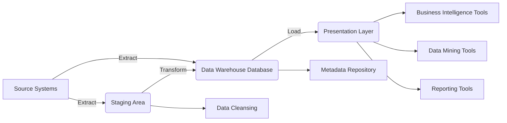
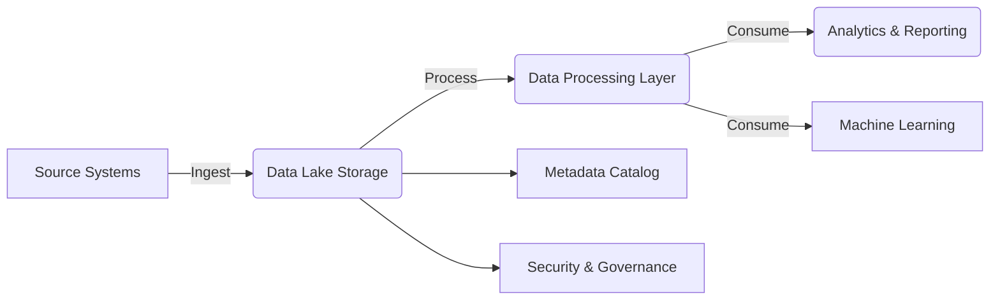
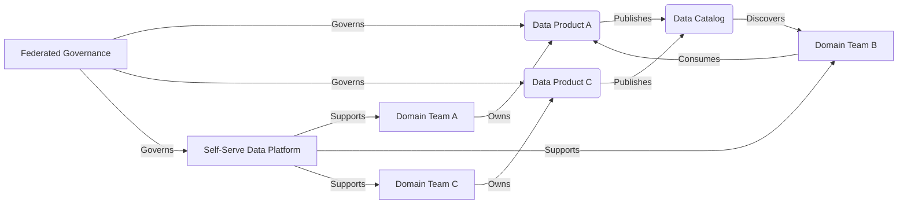

<h1>
  Data Management in AI Projects
  Data Repositories
</h1>

Let's explore the different types of data repositories commonly used in AI projects, examining their characteristics, strengths, and weaknesses.

### A. Data Warehouse

#### 1. Definition and Characteristics

 - **Definition:** A **centralized repository** specifically designed for storing **structured data** from various sources, optimized for **analytical queries and reporting**.
 - **Key Characteristics:**
     - **Subject-Oriented:** Organized around key business subjects (e.g., customers, products, sales).
     - **Integrated:** Combines data from multiple sources into a unified view.
     - **Time-Variant:** Data is tracked over time, enabling historical analysis.
     - **Non-Volatile:** Data is typically not updated or deleted once loaded, ensuring a consistent historical record.
     - **Schema-on-Write:** The structure of the data is defined *before* data is loaded into the warehouse.

#### 2. Architecture and Components

Here's a Mermaid diagram illustrating the architecture of a typical data warehouse:

 - **Source Systems:** Operational databases (e.g., CRM, ERP), transactional systems, and external data feeds.
 - **ETL (Extract, Transform, Load) Processes:** Extract data from source systems, transform it into a consistent format, and load it into the data warehouse.
 - **Staging Area:** A temporary storage area where data is cleansed and transformed before being loaded into the warehouse.
 - **Data Warehouse Database:** Typically a relational database (e.g., Snowflake, Amazon Redshift, Google BigQuery, Azure Synapse Analytics) optimized for analytical queries.
 - **Metadata Repository:** Stores information about the data in the warehouse, such as data definitions, data sources, and transformation rules.
 - **Presentation Layer:** Tools and applications used to access and analyze the data in the warehouse (e.g., reporting tools, business intelligence dashboards, data visualization tools).

#### 3. ETL Processes and Data Integration

 - **Extract:** Retrieving data from various source systems using connectors, APIs, or custom scripts.
 - **Transform:**
     - **Data Cleansing:** Correcting errors, handling missing values, removing duplicates.
     - **Data Standardization:** Converting data to a consistent format (e.g., standardizing date formats, address formats).
     - **Data Aggregation:** Summarizing data (e.g., calculating totals, averages).
     - **Data Enrichment:** Adding new information to the data.
 - **Load:** Loading the transformed data into the data warehouse, often using bulk loading techniques for efficiency.
 - **Data Integration:** Combining data from multiple sources into a unified view, resolving inconsistencies and creating relationships between data elements.
 - **ETL Tools:** Informatica PowerCenter, Talend, IBM DataStage, Microsoft SQL Server Integration Services (SSIS).

#### 4. Use Cases and Benefits for AI Projects

 - **Historical Data Analysis:** Training AI models on historical trends and patterns to make predictions about the future.
 - **Feature Engineering:** Creating aggregated features from historical data to improve model accuracy.
     - **Example:** Calculating the total amount spent by a customer over the past year.
 - **Model Evaluation:** Comparing model predictions against historical data to assess model performance.
 - **Structured Data Analysis:** Analyzing well-defined, structured data from operational systems to gain insights into business performance.
 - **Reporting and Business Intelligence:** Providing a consolidated view of data for reporting, dashboards, and business intelligence applications.
 - **Benefits:**
     - **Improved Decision-Making:** Provides a single source of truth for data analysis, leading to better-informed decisions.
     - **Enhanced Business Performance:** Enables organizations to identify trends, patterns, and opportunities for improvement.
     - **Increased Efficiency:** Automates data integration and reporting processes.

**Example:**
- **ShopSmart:** Uses a data warehouse to store its structured sales, customer, and product data. This allows them to analyze historical sales trends, identify best-selling products, and segment customers for targeted marketing campaigns. They can also use this data to train machine learning models for demand forecasting and inventory optimization.
- **Bank:** Might use a data warehouse to store customer demographics, account information, and transaction history. This enables them to analyze customer behavior, identify potential risks, and develop personalized financial products.

### B. Data Lake

#### 1. Definition and Characteristics

 - **Definition:** A **centralized repository** designed to store **vast amounts of raw data in its native format**, regardless of structure (structured, semi-structured, unstructured).
 - **Key Characteristics:**
     - **Schema-on-Read:** The structure of the data is applied when the data is *read*, not when it is written. This provides flexibility and agility.
     - **Scalability:** Can store petabytes or even exabytes of data.
     - **Variety:** Handles all types of data, including structured, semi-structured, and unstructured data.
     - **Agility:** Supports various data processing and analysis tools.
     - **Cost-Effective:** Often uses low-cost storage solutions.

#### 2. Differences from Data Warehouses

| Feature        | Data Warehouse                        | Data Lake                                         |
| :-------------- | :----------------------------------- | :------------------------------------------------ |
| Data Type      | Structured                            | Structured, semi-structured, unstructured        |
| Schema         | Schema-on-write                      | Schema-on-read                                   |
| Processing     | ETL (Extract, Transform, Load)        | ELT (Extract, Load, Transform) or no transformation |
| Users          | Business analysts, data analysts      | Data scientists, data engineers, researchers      |
| Agility        | Less agile                            | More agile                                        |
| Storage        | Relational databases                  | Distributed file systems (HDFS), cloud storage   |
| Data Volume    | Gigabytes to Terabytes                | Terabytes to Petabytes or more                    |
| Cost           | Generally higher                      | Generally lower                                   |

#### 3. Architecture and Technologies

Here's a Mermaid diagram illustrating the architecture of a data lake:

 - **Storage Layer:**
     - **Hadoop Distributed File System (HDFS):** An open-source distributed file system designed for storing large datasets across a cluster of commodity hardware.
     - **Cloud Object Storage:** Services like Amazon S3, Azure Data Lake Storage, and Google Cloud Storage provide scalable and cost-effective storage for data lakes.
 - **Ingestion Layer:** Tools for ingesting data from various sources into the data lake.
     - **Apache Kafka:** A distributed streaming platform for handling real-time data streams.
     - **Apache Flume:** A distributed service for collecting, aggregating, and moving large amounts of log data.
     - **Apache Sqoop:** A tool for transferring data between Hadoop and relational databases.
 - **Processing Layer:** Tools for processing and analyzing data in the data lake.
     - **Apache Spark:** A fast and general-purpose cluster computing framework.
     - **Apache Hive:** A data warehouse system built on top of Hadoop that provides an SQL-like interface for querying data.
     - **Apache Presto:** A distributed SQL query engine for running interactive analytic queries against large datasets.
 - **Metadata Catalog:** Stores information about the data in the lake, such as schema, data lineage, and access control policies.
     - **AWS Glue Data Catalog:** A fully managed metadata catalog service provided by AWS.
     - **Azure Data Catalog:** A fully managed data discovery and metadata management service offered by Azure
     - **Apache Hive Metastore:** Can be used as metadata catalog.
 - **Security and Governance Layer:** Tools and services for securing data in the lake and enforcing data governance policies.

#### 4. Challenges and Best Practices

 - **Data Swamp:** Without proper governance and metadata management, a data lake can become a dumping ground for unorganized and unusable data, making it difficult to find and analyze the data you need.
 - **Data Discovery:** Finding the right data in a vast and diverse data lake can be challenging without a good metadata catalog and search capabilities.
 - **Data Security:** Protecting sensitive data in the data lake requires careful planning and implementation of access controls, encryption, and other security measures.
 - **Data Quality:** Maintaining data quality in a data lake can be difficult due to the variety of data sources and formats.
 - **Best Practices:**
     - **Implement a Metadata Catalog:** Use a metadata catalog to track data lineage, schema, and other important information about the data in the lake.
     - **Establish Data Governance Policies:** Define clear policies for data access, usage, quality, and security in the data lake.
     - **Use Data Quality Tools:** Implement data quality checks and validation processes to ensure the accuracy and consistency of data in the lake.
     - **Implement Security Controls:** Use access controls, encryption, and other security measures to protect sensitive data.
     - **Plan for Data Lifecycle Management:** Define policies for data retention, archival, and deletion in the data lake.

**Example:**
- **ShopSmart:** Uses a data lake to store raw data from various sources, including website clickstreams, social media feeds, product images, product videos, and sensor data from its physical stores (if any). This allows data scientists to explore the raw data, experiment with new features, and build more sophisticated AI models. For example, they could analyze raw clickstream data alongside product images to understand which visual elements are most engaging to customers.
- **Healthcare:** A hospital might use a data lake to store all patient data, including EHRs, medical images, and genomic data. This allows researchers to analyze the data to identify new disease patterns or develop personalized treatments.

### C. Data Mesh

#### 1. Introduction to the Concept

 - **Data Mesh** is a relatively new **decentralized data architecture** that addresses some of the limitations of traditional centralized data architectures like data warehouses and data lakes, particularly in large, complex organizations.
 - It's based on the principles of **domain-driven design**, **product thinking**, and **self-serve infrastructure**.
 - Instead of a central data team managing all data, data mesh advocates for **distributed data ownership**, where each domain team is responsible for managing its own data as a product.

#### 2. Principles of Data Mesh

 - **Domain Ownership:** Each domain team (e.g., sales, marketing, customer service) owns its data end-to-end, from data collection to data consumption.
 - **Data as a Product:** Domain teams treat their data as a product that they develop, maintain, and support. Data products must be:
     - **Discoverable:** Easily found by other teams.
     - **Addressable:** Accessible through a standard interface.
     - **Trustworthy:** High quality and reliable.
     - **Self-describing:** Well-documented with clear semantics and syntax.
     - **Interoperable:** Compatible with other data products.
     - **Secure:** Protected by appropriate access controls.
 - **Self-Serve Data Platform:** A platform that provides the tools and infrastructure that domain teams need to create, manage, and share their data products without requiring specialized data engineering expertise.
     - **Capabilities:**
         - Data storage and processing
         - Data cataloging and discovery
         - Data quality monitoring
         - Data lineage tracking
         - Access control and security
 - **Federated Computational Governance:** A system of governance that ensures interoperability and consistency across data products while still allowing domain teams to have autonomy.
     - **Global Standards:** A set of standards that all data products must adhere to.
     - **Automated Compliance:** Using automation to enforce governance policies.

#### 3. Implementing Data Mesh Architecture

Here's a Mermaid diagram illustrating the high-level architecture of a data mesh:

 - **Data Product:** The fundamental unit of a data mesh. It's a self-contained dataset that is designed to meet the specific needs of a particular use case or set of use cases.
     - **Components:**
         - **Code:** Code for data pipelines, APIs, and other data processing logic.
         - **Data:** The actual data itself.
         - **Metadata:** Information about the data, such as schema, data lineage, and access control policies.
         - **Infrastructure:** The resources needed to run the data product, such as compute, storage, and networking.
 - **Data Infrastructure as a Platform:** Provides the underlying infrastructure that domain teams need to build and manage their data products.
 - **Federated Governance Team:** A team responsible for defining and enforcing global standards and policies, ensuring interoperability between data products, and providing guidance and support to domain teams. This team should not be a bottleneck, but enabler.

#### 4. Advantages and Challenges for AI Projects

 - **Advantages:**
     - **Increased Agility and Scalability:** Domain teams can move faster and scale their data products independently, without being constrained by a centralized data team or infrastructure. This accelerates AI development and deployment.
     - **Improved Data Quality:** Domain teams are closer to the data and have a better understanding of its context, leading to higher quality data products.
     - **Faster Time to Insight:** Data products are designed for specific use cases, making it easier and faster to extract insights.
     - **Better Alignment with Business Needs:** Domain-driven data products are more likely to be aligned with the specific needs of the business.
     - **Democratization of Data:** Makes data more accessible to a wider range of users within the organization.
 - **Challenges:**
     - **Organizational Change:** Implementing a data mesh requires a significant shift in organizational culture, structure, and mindset. It requires a move away from centralized control towards a more distributed and collaborative model.
     - **Technical Complexity:** Building a self-serve data platform and implementing federated governance can be technically challenging.
     - **Skill Gaps:** Domain teams may need to develop new skills in data engineering, data management, and product management.
     - **Potential for Data Silos:** If not properly governed, a data mesh could lead to the creation of new data silos if domain teams do not adequately share or standardize their data.
     - **Requires Strong Leadership:** Successfully transitioning to a data mesh requires strong leadership and buy-in from all levels of the organization.

**Example:**
- **ShopSmart:** The marketing team could own a "customer demographics" data product, the sales team could own a "sales transactions" data product, and the logistics team could own a "shipping and delivery" data product. Each team would be responsible for the quality, documentation, and accessibility of their data product, including relevant data like product images and videos for the product team. These data products would be discoverable and accessible through a centralized data catalog. AI models could then be built using a combination of these data products. For instance, a recommendation engine might use the "customer demographics," "sales transactions," and "product catalog" data products.
- **Financial Institution:** Different departments, such as risk, compliance, and customer service, could each own their own data products. The risk team might create a "credit risk" data product, while the customer service team might create a "customer interactions" data product.

## Scenario-Based Activity: Exploring Data Repositories

### Scenario:
**ShopSmart**, our e-commerce company, is expanding its AI initiatives. They are also growing in the types of data they collect and manage, including **product images, product descriptions (text), and videos demonstrating product features,** on top of the usual structured and semi-structured data. They need to improve their data management infrastructure to support the following use cases:

-   **Historical Sales Trends Analysis:** Aggregating and analyzing structured sales and customer data to identify seasonal trends and predict future demand.
-   **Clickstream Data Exploration:** Storing and analyzing raw website clickstream data to optimize customer experiences.
-   **Product Image and Video Management:**  Storing, processing and analyzing product images and videos to be used for visual search, product tagging and content recommendations.
-   **AI Model Development:** Creating datasets for building and training AI models for recommendation systems, customer segmentation, and fraud detection.
-   **Decentralized Data Ownership:** Allowing each department (e.g., marketing, sales, logistics, product) to manage its own data while ensuring standardization and governance.

### Task:
Form small groups (3–5 participants) and answer the following questions based on the scenario.

1.  **Select Appropriate Data Repositories**  
    Recommend a repository type (Data Warehouse, Data Lake, or Data Mesh) for each of the following needs:
    -   Storing structured historical sales and customer data.
    -   Managing raw clickstream data for analysis.
    -   Storing and managing large volumes of product images and videos.
    -   Supporting decentralized data ownership across departments.
    -   Integrating data for building and training AI models.

2.  **Justify Your Choices**  
    For each repository type selected, explain:
    -   Why it is the most suitable for the given use case.
    -   How it addresses the challenges in the scenario.
    -   Any potential limitations or trade-offs.

3.  **Collaborative Discussion**  
    Discuss how ShopSmart could implement best practices to ensure data quality, governance, and scalability for their selected repositories. Consider the following:
    - How can ShopSmart ensure the quality and consistency of product images and videos across different departments?
    - How can ShopSmart implement a governance model that balances departmental autonomy with the need for data standardization and interoperability?

### Deliverable:
Each group will share a brief summary of their recommendations and insights with the class, highlighting the rationale behind their choices.

## Case Study Spotlight:

To illustrate data management principles in action across different industries, let's briefly examine a few real-world case studies:

**1. Netflix (Entertainment):**
- **Challenge:** Managing petabytes of data generated by user interactions, viewing history, and content metadata to personalize recommendations.
- **Solution:** Leverages a **data lake** architecture built on AWS S3 to store vast amounts of raw data. They use a combination of **batch and stream processing** with tools like Apache Spark and Apache Kafka to analyze this data and train their recommendation algorithms. They also use a **microservices architecture** which aligns with some principles of **data mesh**, allowing different teams to manage data relevant to their services.
- **Outcome:** Highly personalized recommendations that drive user engagement and retention.

**2. Capital One (Finance):**
- **Challenge:** Detecting fraudulent transactions in real-time while ensuring a seamless customer experience.
- **Solution:** Uses a combination of **data warehouse and data lake** technologies, along with **real-time stream processing**. They ingest and process massive amounts of transaction data, enriching it with external data sources. They use machine learning models trained on historical data to identify and flag suspicious activity.
- **Outcome:** Reduced fraud losses and improved customer satisfaction.

**3. General Electric (Manufacturing):**
- **Challenge:** Optimizing the performance and maintenance of industrial equipment, such as jet engines and gas turbines.
- **Solution:** Implemented a **data lake** based on Hadoop to store sensor data from their equipment. They use **machine learning** to analyze this data and build predictive maintenance models that anticipate equipment failures.
- **Outcome:** Reduced downtime, improved efficiency, and significant cost savings.

**4. NHS (Healthcare):**
 - **Challenge:** The National Health Service (NHS) in the UK faced the challenge of managing vast amounts of patient data scattered across various systems and formats, making it difficult to gain a holistic view of patient care and make data-driven decisions.
 - **Solution:** The NHS has been working towards a more integrated approach, using **data warehouses and data lakes** to consolidate patient data from different sources. They are implementing **data standards** and **interoperability** initiatives to ensure that data can be shared securely and effectively across different healthcare providers. They are also exploring the use of **AI and machine learning** for tasks such as early diagnosis, personalized medicine, and resource optimization.

 - **Outcome:** Improved patient care through better data sharing, leading to more accurate diagnoses, personalized treatments, and efficient resource allocation. The NHS has also been able to use data analytics for public health monitoring and planning, such as tracking disease outbreaks and identifying high-risk populations.

